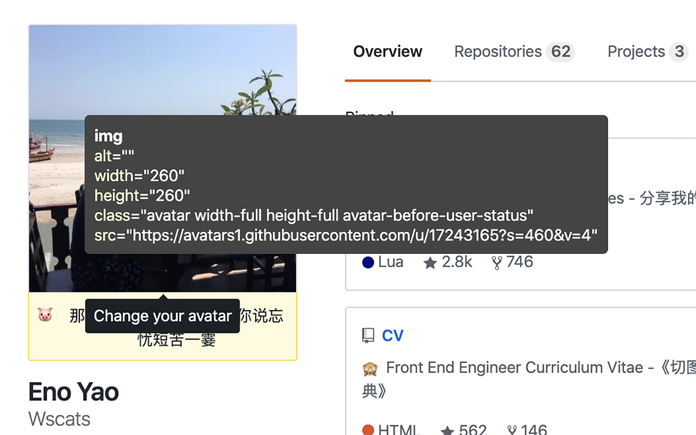

# Spy

Download: [Google Extension](https://chrome.google.com/webstore/detail/spy/fjidbhefebofcjhnjbifaejndlhlffoo?hl=zh-CN)

A simple module that displays DOM attributes on mouseover inside a tooltip.

# Demo

# Instructions

Copy and paste the entire code into your web console
Include the JS file in your code base
This is implemented as an IIFE so the spy is turned on immediately upon execution.

# Use cases
Help troubleshoot a UI bug
Ensure that your app's DOM elements are working as expected (getting the right class on click, etc)
Find out how another web app is structured

# Thanks

- [spyon](https://github.com/eddieherm/spyon)

## License

Spy is released under the MIT.

<!-- # Keycodes

| Key Name      | Constant          | Value |
| ------------- | ----------------- | ----- |
| Cancel        | KEY_CANCEL        | 3     |
| Help          | KEY_HELP          | 6     |
| Backspace     | KEY_BACK_SPACE    | 8     |
| Tab           | KEY_TAB           | 9     |
| Clear         | KEY_CLEAR         | 12    |
| Return        | KEY_RETURN        | 13    |
| Enter         | KEY_ENTER         | 14    |
| Shift         | KEY_SHIFT         | 16    |
| Control       | KEY_CONTROL       | 17    |
| Alt           | KEY_ALT           | 18    |
| Pause         | KEY_PAUSE         | 19    |
| Caps Lock     | KEY_CAPS_LOCK     | 20    |
| Escape        | KEY_ESCAPE        | 27    |
| Space         | KEY_SPACE         | 32    |
| Page up       | KEY_PAGE_UP       | 33    |
| Page down     | KEY_PAGE_DOWN     | 34    |
| End           | KEY_END           | 35    |
| Home          | KEY_HOME          | 36    |
| Left          | KEY_LEFT          | 37    |
| Up            | KEY_UP            | 38    |
| Right         | KEY_RIGHT         | 39    |
| Down          | KEY_DOWN          | 40    |
| Print Screen  | KEY_PRINTSCREEN   | 44    |
| Insert        | KEY_INSERT        | 45    |
| Delete        | KEY_DELETE        | 46    |
| 0             | KEY_0             | 48    |
| 1             | KEY_1             | 49    |
| 2             | KEY_2             | 50    |
| 3             | KEY_3             | 51    |
| 4             | KEY_4             | 52    |
| 5             | KEY_5             | 53    |
| 6             | KEY_6             | 54    |
| 7             | KEY_7             | 55    |
| 8             | KEY_8             | 56    |
| 9             | KEY_9             | 57    |
| Semicolon     | KEY_SEMICOLON     | 59    |
| Equals        | KEY_EQUALS        | 61    |
| A             | KEY_A             | 65    |
| B             | KEY_B             | 66    |
| C             | KEY_C             | 67    |
| D             | KEY_D             | 68    |
| E             | KEY_E             | 69    |
| F             | KEY_F             | 70    |
| G             | KEY_G             | 71    |
| H             | KEY_H             | 72    |
| I             | KEY_I             | 73    |
| J             | KEY_J             | 74    |
| K             | KEY_K             | 75    |
| L             | KEY_L             | 76    |
| M             | KEY_M             | 77    |
| N             | KEY_N             | 78    |
| O             | KEY_O             | 79    |
| P             | KEY_P             | 80    |
| Q             | KEY_Q             | 81    |
| R             | KEY_R             | 82    |
| S             | KEY_S             | 83    |
| T             | KEY_T             | 84    |
| U             | KEY_U             | 85    |
| V             | KEY_V             | 86    |
| W             | KEY_W             | 87    |
| X             | KEY_X             | 88    |
| Y             | KEY_Y             | 89    |
| Z             | KEY_Z             | 90    |
| Left ⌘        | KEY_LEFT_CMD      | 91    |
| Right ⌘       | KEY_RIGHT_CMD     | 93    |
| Context Menu  | KEY_CONTEXT_MENU  | 93    |
| Numpad 0      | KEY_NUMPAD0       | 96    |
| Numpad 1      | KEY_NUMPAD1       | 97    |
| Numpad 2      | KEY_NUMPAD2       | 98    |
| Numpad 3      | KEY_NUMPAD3       | 99    |
| Numpad 4      | KEY_NUMPAD4       | 100   |
| Numpad 5      | KEY_NUMPAD5       | 101   |
| Numpad 6      | KEY_NUMPAD6       | 102   |
| Numpad 7      | KEY_NUMPAD7       | 103   |
| Numpad 8      | KEY_NUMPAD8       | 104   |
| Numpad 9      | KEY_NUMPAD9       | 105   |
| Multiply      | KEY_MULTIPLY      | 106   |
| Add           | KEY_ADD           | 107   |
| Separator     | KEY_SEPARATOR     | 108   |
| Subtract      | KEY_SUBTRACT      | 109   |
| Decimal       | KEY_DECIMAL       | 110   |
| Divide        | KEY_DIVIDE        | 111   |
| F1            | KEY_F1            | 112   |
| F2            | KEY_F2            | 113   |
| F3            | KEY_F3            | 114   |
| F4            | KEY_F4            | 115   |
| F5            | KEY_F5            | 116   |
| F6            | KEY_F6            | 117   |
| F7            | KEY_F7            | 118   |
| F8            | KEY_F8            | 119   |
| F9            | KEY_F9            | 120   |
| F10           | KEY_F10           | 121   |
| F11           | KEY_F11           | 122   |
| F12           | KEY_F12           | 123   |
| F13           | KEY_F13           | 124   |
| F14           | KEY_F14           | 125   |
| F15           | KEY_F15           | 126   |
| F16           | KEY_F16           | 127   |
| F17           | KEY_F17           | 128   |
| F18           | KEY_F18           | 129   |
| F19           | KEY_F19           | 130   |
| F20           | KEY_F20           | 131   |
| F21           | KEY_F21           | 132   |
| F22           | KEY_F22           | 133   |
| F23           | KEY_F23           | 134   |
| F24           | KEY_F24           | 135   |
| Num Lock      | KEY_NUM_LOCK      | 144   |
| Scroll Lock   | KEY_SCROLL_LOCK   | 145   |
| Comma         | KEY_COMMA         | 188   |
| Period        | KEY_PERIOD        | 190   |
| Slash         | KEY_SLASH         | 191   |
| Back Quote    | KEY_BACK_QUOTE    | 192   |
| Open Bracket  | KEY_OPEN_BRACKET  | 219   |
| Back Slash    | KEY_BACK_SLASH    | 220   |
| Close Bracket | KEY_CLOSE_BRACKET | 221   |
| Quote         | KEY_QUOTE         | 222   |
| Meta          | KEY_META          | 224   | -->